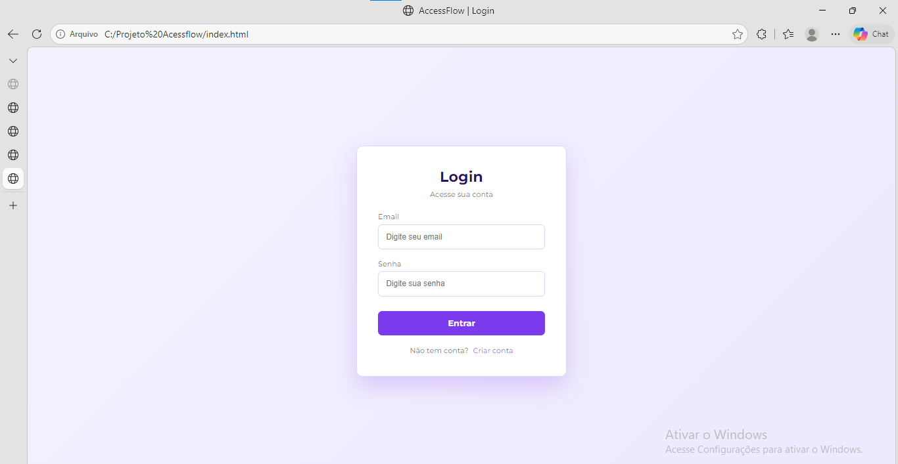
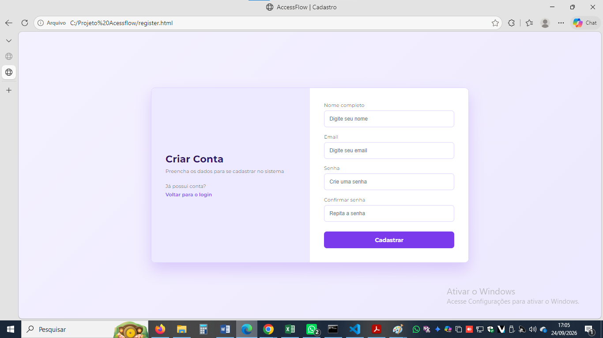

# AccessFlow

## Descrição
O AccessFlow é uma interface web de login e cadastro desenvolvida utilizando HTML5 e CSS3 como atividade de recuperação do componente Projeto Prático Web.

## Objetivo
Criação de uma tela de login responsiva.

## Tecnologias utilizadas
- HTML5
- CSS3
- Google Fonts — Montserrat
- Git
- GitHub

## Funcionalidades
- Tela de Login
- Tela de Cadastro
- Navegação entre páginas
- Formulários HTML
- Interface responsiva

## Estrutura de pastas
```
AccessFlow/
├── index.html
├── register.html
├── README.md
├── images/
│   ├── login.png
│   └── cadastro.png
└── css/
    ├── style.css
    └── register.css
```

## Capturas de tela

### Tela de Login


### Tela de Cadastro


## Autor
**Camila Fernandes**

Professor: Heraclides Mourão
